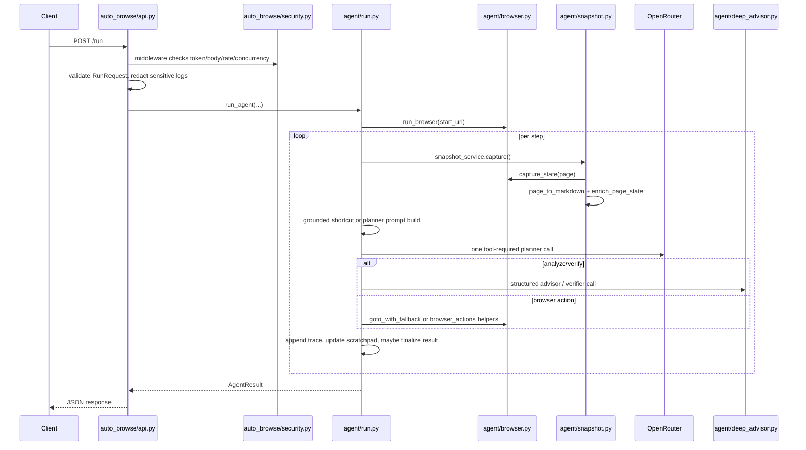
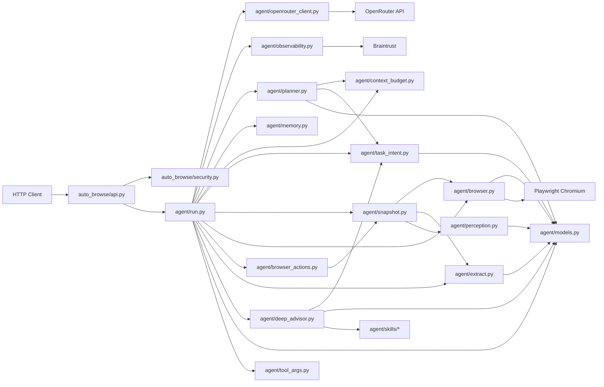

# Agent Runtime Map

This document explains how the agent actually interacts with the codebase and with external systems so cleanup work can be based on real reachability, not guesses.

The short version:

- The production runtime is centered on [`agent/run.py`](../agent/run.py).
- The public HTTP entrypoint is [`auto_browse/api.py`](../auto_browse/api.py).
- The browser-facing stack is `browser.py -> snapshot.py -> perception.py -> browser_actions.py`.
- The model-facing stack is `planner.py -> openrouter_client.py -> deep_advisor.py`.
- The main "delete crap" opportunity is not orphaned core runtime files. It is feature slices and support-only code.

## 1. External Interaction Surface

The agent touches these external systems:

| External system | Where it connects | Why it exists |
| --- | --- | --- |
| FastAPI / Uvicorn | `auto_browse/api.py` | Accepts `/run` requests and returns `AgentResult` |
| HTTP clients | `auto_browse/api.py`, `auto_browse/security.py` | Send task payloads into the agent |
| Playwright Chromium | `agent/browser.py`, `agent/browser_actions.py` | Opens pages, collects interactables, executes actions |
| OpenRouter via `ChatOpenAI` | `agent/openrouter_client.py` | Planner LLM for tool selection |
| Deep Agents | `agent/deep_advisor.py` | Secondary advisor/verifier for ambiguous states |
| Braintrust | `agent/observability.py` | Optional tracing only; runtime works without it |
| Local config/env files | `config/config.ini`, `config/security.toml`, `.env` | Model selection, API token, rate limits, tracing |
| Local skill files | `agent/skills/*` | Loaded by Deep Agents subagents |

## 2. End-to-End Request Flow

### 2.1 Sequence



### 2.2 LangGraph Loop

The actual runtime state machine is built in [`agent/run.py:2375`](../agent/run.py#L2375) and compiled from four nodes:

- `capture`
- `llm`
- `execute_tools`
- `post_tool`

The graph edges are:

```text
START -> capture -> llm -> execute_tools -> post_tool
post_tool -> capture   (if still running)
post_tool -> END       (if result exists)
llm -> END             (if result exists early)
```

## 3. Module Dependency Diagram



## 4. What Each Runtime File Does

### 4.1 Entrypoints and public surface

| File | Status | What it does | Key references |
| --- | --- | --- | --- |
| `auto_browse/api.py` | Active runtime | Creates FastAPI app, validates request payloads, builds client, calls `run_agent`, maps errors to HTTP | [`auto_browse/api.py:49`](../auto_browse/api.py#L49), [`auto_browse/api.py:210`](../auto_browse/api.py#L210) |
| `auto_browse/security.py` | Active runtime | API token enforcement, body-size limit, per-IP rate limiting, concurrency limiting, optional proxy trust | [`auto_browse/security.py:257`](../auto_browse/security.py#L257), [`auto_browse/security.py:336`](../auto_browse/security.py#L336) |
| `auto_browse/__init__.py` | Active public package surface | Re-exports `run_agent`, `create_app`, models, and `OpenRouterClient` | [`auto_browse/__init__.py:1`](../auto_browse/__init__.py#L1) |

### 4.2 Orchestration

| File | Status | What it does | Key references |
| --- | --- | --- | --- |
| `agent/run.py` | Core runtime | Owns `_Runtime`, LangGraph loop, tool definitions, final result assembly, shortcut logic, fallback logic | [`agent/run.py:87`](../agent/run.py#L87), [`agent/run.py:589`](../agent/run.py#L589), [`agent/run.py:1474`](../agent/run.py#L1474), [`agent/run.py:2394`](../agent/run.py#L2394) |
| `agent/models.py` | Core runtime | Defines `Interactable`, `PageState`, `AgentDecision`, `AgentStepTrace`, `AgentResult` | [`agent/models.py:32`](../agent/models.py#L32), [`agent/models.py:45`](../agent/models.py#L45), [`agent/models.py:54`](../agent/models.py#L54), [`agent/models.py:101`](../agent/models.py#L101) |
| `agent/tool_args.py` | Core runtime | Pydantic schemas for every tool exposed to the planner | Imported by [`agent/run.py:65`](../agent/run.py#L65) |

### 4.3 Browser-side state generation

| File | Status | What it does | Key references |
| --- | --- | --- | --- |
| `agent/browser.py` | Core runtime | Starts Playwright, normalizes URL, navigates, extracts visible interactables, labels, regions, hrefs, refs | [`agent/browser.py:121`](../agent/browser.py#L121), [`agent/browser.py:772`](../agent/browser.py#L772), [`agent/browser.py:816`](../agent/browser.py#L816) |
| `agent/snapshot.py` | Core runtime | Caches page snapshots, retries thin search-result pages, attaches markdown, runs perception enrichment | [`agent/snapshot.py:115`](../agent/snapshot.py#L115), [`agent/snapshot.py:129`](../agent/snapshot.py#L129), [`agent/snapshot.py:183`](../agent/snapshot.py#L183) |
| `agent/perception.py` | Core runtime | Classifies page archetype (`form`, `search_results`, `quote`, etc.) and page hints | [`agent/perception.py:137`](../agent/perception.py#L137), [`agent/perception.py:209`](../agent/perception.py#L209), [`agent/perception.py:273`](../agent/perception.py#L273) |
| `agent/extract.py` | Core runtime | Converts page HTML to markdown for planner/advisor context and extraction | Imported by [`agent/run.py:47`](../agent/run.py#L47) and [`agent/snapshot.py:10`](../agent/snapshot.py#L10) |

### 4.4 Planner-side reasoning

| File | Status | What it does | Key references |
| --- | --- | --- | --- |
| `agent/planner.py` | Core runtime | Builds system/human prompt, injects interactables, trace, blocker alerts, prompt-injection alerts, working memory | [`agent/planner.py:11`](../agent/planner.py#L11), [`agent/planner.py:240`](../agent/planner.py#L240), [`agent/planner.py:379`](../agent/planner.py#L379) |
| `agent/context_budget.py` | Core runtime | Computes prompt/advisor budgets based on page archetype and extraction mode | [`agent/context_budget.py:9`](../agent/context_budget.py#L9), [`agent/context_budget.py:38`](../agent/context_budget.py#L38) |
| `agent/memory.py` | Core runtime | Maintains scratchpad of visited URLs, filled fields, failures, and current plan step | Imported by [`agent/run.py:52`](../agent/run.py#L52), used at [`agent/run.py:1983`](../agent/run.py#L1983) and [`agent/run.py:2276`](../agent/run.py#L2276) |
| `agent/task_intent.py` | Core runtime | Extracts task query, identifies search inputs, tracks search progression, ranks result links, checks destination match | [`agent/task_intent.py:94`](../agent/task_intent.py#L94), [`agent/task_intent.py:294`](../agent/task_intent.py#L294), [`agent/task_intent.py:383`](../agent/task_intent.py#L383), [`agent/task_intent.py:436`](../agent/task_intent.py#L436) |

### 4.5 Action execution and verification

| File | Status | What it does | Key references |
| --- | --- | --- | --- |
| `agent/browser_actions.py` | Core runtime | Low-level selector fallback generation plus actual click/fill/type/submit/select/check/wait helpers | [`agent/browser_actions.py:129`](../agent/browser_actions.py#L129), [`agent/browser_actions.py:238`](../agent/browser_actions.py#L238), [`agent/browser_actions.py:287`](../agent/browser_actions.py#L287), [`agent/browser_actions.py:339`](../agent/browser_actions.py#L339) |
| `agent/deep_advisor.py` | Core runtime, optional feature path | Runs structured Deep Agents analysis and goal verification; falls back to local heuristics when advisor fails | [`agent/deep_advisor.py:46`](../agent/deep_advisor.py#L46), [`agent/deep_advisor.py:187`](../agent/deep_advisor.py#L187), [`agent/deep_advisor.py:265`](../agent/deep_advisor.py#L265), [`agent/deep_advisor.py:413`](../agent/deep_advisor.py#L413), [`agent/deep_advisor.py:443`](../agent/deep_advisor.py#L443), [`agent/deep_advisor.py:486`](../agent/deep_advisor.py#L486) |
| `agent/skills/*` | Core runtime when Deep Agents enabled | Local skill prompts loaded by `deep_advisor.py` as `/agent/skills/` | [`agent/deep_advisor.py:67`](../agent/deep_advisor.py#L67), [`agent/deep_advisor.py:421`](../agent/deep_advisor.py#L421) |

### 4.6 Integrations and tracing

| File | Status | What it does | Key references |
| --- | --- | --- | --- |
| `agent/openrouter_client.py` | Core runtime | Reads API key and model config, constructs `ChatOpenAI` against OpenRouter base URL | [`agent/openrouter_client.py:91`](../agent/openrouter_client.py#L91), [`agent/openrouter_client.py:105`](../agent/openrouter_client.py#L105) |
| `agent/observability.py` | Active but optional | Braintrust spans/logging/export; becomes no-op when disabled | [`agent/observability.py:53`](../agent/observability.py#L53), [`agent/observability.py:97`](../agent/observability.py#L97), [`agent/observability.py:135`](../agent/observability.py#L135), [`agent/observability.py:144`](../agent/observability.py#L144) |
| `agent/default_openrouter_config.ini` | Active packaged fallback | Default model source when local `config/config.ini` is missing | Used by [`agent/openrouter_client.py:76`](../agent/openrouter_client.py#L76) |

## 5. Deep Dive: What Happens Inside `agent/run.py`

### 5.1 Runtime object

`_Runtime` in [`agent/run.py:87`](../agent/run.py#L87) is the shared mutable runtime state. It holds:

- Playwright `page`
- cached `snapshot_service`
- request inputs
- current trace
- current page state
- last verification result
- scratchpad working memory

If you want to understand the whole system, start here.

### 5.2 Capture node

The `capture` node:

1. Calls `PageSnapshotService.capture()`.
2. Re-syncs snapshot URL/title with the actual Playwright page if they drift.
3. Stores `runtime.current_page_state`.

Relevant code:

- [`agent/run.py:1474`](../agent/run.py#L1474) begins graph construction
- capture logic starts immediately under that function
- snapshot service logic is in [`agent/snapshot.py:129`](../agent/snapshot.py#L129)

### 5.3 LLM node

The `llm` node does not always call the LLM.

It first tries:

1. Reusing recent fallback analysis
2. Grounded shortcuts for search flows
3. Only then building planner messages and calling OpenRouter

That behavior lives around:

- grounded shortcut / reuse logic: [`agent/run.py:1947`](../agent/run.py#L1947)
- planner prompt assembly: [`agent/run.py:1962`](../agent/run.py#L1962)
- scratchpad injection: [`agent/run.py:1983`](../agent/run.py#L1983)
- retry/fallback when the LLM times out or emits no tool call: [`agent/run.py:1985`](../agent/run.py#L1985)

### 5.4 Execute tools node

The tool bridge is built in `_build_tools()` at [`agent/run.py:589`](../agent/run.py#L589).

Tool families:

- advisory: `analyze_page`, `verify_goal`
- browser actions: `type_and_submit`, `fill`, `submit`, `select_option`, `check`, `wait_for`, `click`, `navigate`
- terminal: `extract_answer`, `complete_goal`, `fail`

Important behavior:

- every action is normalized into `AgentDecision` JSON
- many actions verify effect with DOM signatures before being considered successful
- successful mutating actions invalidate cached snapshot state

Examples:

- analyze tool: [`agent/run.py:777`](../agent/run.py#L777)
- verify tool: [`agent/run.py:840`](../agent/run.py#L840)
- click tool: [`agent/run.py:1178`](../agent/run.py#L1178)
- navigate tool: [`agent/run.py:1249`](../agent/run.py#L1249)
- extract terminal tool: [`agent/run.py:1295`](../agent/run.py#L1295)
- complete terminal tool: [`agent/run.py:1403`](../agent/run.py#L1403)

### 5.5 Post-tool node

`post_tool`:

1. Converts tool outputs back into `AgentDecision`
2. Creates `AgentStepTrace`
3. Updates scratchpad
4. Emits step callback/logging
5. Materializes `AgentResult` when a terminal action occurs

See [`agent/run.py:2228`](../agent/run.py#L2228) and scratchpad update at [`agent/run.py:2276`](../agent/run.py#L2276).

## 6. How the Agent Sees the Page

This is the actual visibility pipeline:

```text
Playwright Page
  -> agent/browser.py capture_state()
  -> build interactables with labels/selectors/hrefs/regions/context
  -> agent/extract.py page_to_markdown()
  -> agent/perception.py enrich_page_state()
  -> PageState(url, title, markdown, interactables, page_archetype, page_hints)
```

Important details:

- interactables are not raw DOM dumps; they are ranked and deduped
- each interactable gets a stable `ref` like `el1`, `el2`, ...
- region tagging (`main`, `form`, `nav`, etc.) strongly affects planner behavior
- `PageSnapshotService` retries "thin" results pages before giving up

Key references:

- interactable region/context extraction: [`agent/browser.py:271`](../agent/browser.py#L271)
- interactable ranking: [`agent/browser.py:321`](../agent/browser.py#L321)
- interactable builders: [`agent/browser.py:420`](../agent/browser.py#L420) through [`agent/browser.py:705`](../agent/browser.py#L705)
- state capture: [`agent/browser.py:772`](../agent/browser.py#L772)

## 7. Why It Makes the Decisions It Makes

The planner is not purely LLM-driven. It is a hybrid:

### 7.1 Heuristic layers before the LLM

- `perception.py` classifies page archetype
- `task_intent.py` derives task query and search stage
- `context_budget.py` trims prompt size
- `memory.py` injects working memory
- grounded shortcuts in `run.py` bypass the LLM for obvious search/result actions

### 7.2 Advisor/verifier layer

`deep_advisor.py` is a second reasoning layer, not the main planner.

It is used when the planner explicitly calls:

- `analyze_page(...)`
- `verify_goal(...)`

If Deep Agents fails, `fallback_page_analysis(...)` keeps the run alive with local heuristics.

That means these files are tightly coupled:

```text
run.py
  -> deep_advisor.py
  -> task_intent.py
  -> agent/skills/*
```

Deleting Deep Agents means deleting or rewriting all of that flow, not just one file.

## 8. What Is Actually Safe To Delete

### 8.1 Safe to remove from production runtime only

These are not required for serving `/run` or for `run_agent(...)` itself:

| Path | Why it is not on the production request path |
| --- | --- |
| `tests/*` | test-only |
| `scripts/run_eval.py` | manual/offline evaluation path |
| `scripts/seed_diverse_cases.py` | manual dataset seeding path |

If you are slimming the runtime image, these go first.

### 8.2 Not safe to delete

These looked like possible cleanup targets at first glance but are live:

| Path | Why it is live |
| --- | --- |
| `agent/context_budget.py` | used in planner prompt sizing and Deep Advisor budget sizing |
| `agent/memory.py` | imported by `run.py`; scratchpad is injected into the planner prompt and updated after each step |
| `agent/perception.py` | used by `snapshot.py` on every captured page |
| `agent/task_intent.py` | used by planner, advisor fallback, and run-time shortcuts |
| `agent/browser_actions.py` | every real browser interaction uses it |
| `agent/snapshot.py` | central cached page-state layer |
| `agent/tool_args.py` | tool schemas exposed to the planner |
| `agent/skills/*` | Deep Agents loads these skill directories directly |
| `agent/default_openrouter_config.ini` | packaged fallback config path |
| `agent/__init__.py` | package marker for `agent`, relevant to packaged resources |

### 8.3 Feature-slice deletions that would materially simplify the repo

These are the real cleanup levers.

#### A. Remove Deep Agents entirely

Delete or rewrite:

- `agent/deep_advisor.py`
- `agent/skills/*`
- `analyze_page` and `verify_goal` flows in `agent/run.py`
- tests covering advisor/verifier behavior

Effect:

- smaller runtime surface
- less ambiguity handling
- less conservative goal completion
- simpler debugging

#### B. Remove Braintrust tracing

Delete or rewrite:

- `agent/observability.py`
- span calls in `agent/run.py`
- trace-parent plumbing in `auto_browse/api.py`
- trace-parent export in `scripts/run_eval.py`

Effect:

- simpler runtime
- no tracing spans
- almost no behavior change to agent decisions

This is the lowest-risk feature slice to remove.

#### C. Remove API server, keep library only

Delete or rewrite:

- `auto_browse/api.py`
- `auto_browse/security.py`
- `scripts/run_api.sh`

Keep:

- `agent/*`
- `auto_browse/__init__.py` if you still want public imports

#### D. Remove library surface, keep API only

Potential cleanup:

- trim `auto_browse/__init__.py`
- trim public re-exports that only exist for external Python callers

This is small, but safe if nothing imports the package directly.

## 9. Biggest Structural Cleanup Targets

If the goal is maintainability, not just file count, the highest-value cleanup targets are:

1. `agent/run.py`
   It is the orchestration center, tool registry, fallback engine, graph builder, and result assembler. Splitting it by concern will pay off more than deleting small helper files.

2. Browser action duplication
   Selector fallback logic and execution logic are distributed across `run.py`, `browser.py`, and `browser_actions.py`. That is workable, but hard to reason about.

3. Repeated env/config loaders
   `.env` loading logic exists in multiple modules (`openrouter_client.py`, `security.py`, `scripts/run_eval.py`, `scripts/seed_diverse_cases.py`).

4. Support-only scripts mixed into top-level runtime repo surface
   `scripts/run_eval.py` and `scripts/seed_diverse_cases.py` are useful, but not part of production runtime.

## 10. Recommended Deletion Order

If the immediate goal is "delete unused or non-essential stuff without breaking the product," do it in this order:

1. Remove support-only code from production packaging and deploy images: `tests/*`, `scripts/run_eval.py`, `scripts/seed_diverse_cases.py`.
2. Decide whether Braintrust tracing is worth keeping. If not, remove `agent/observability.py` and related plumbing.
3. Decide whether Deep Agents is worth keeping. If not, remove `agent/deep_advisor.py`, `agent/skills/*`, and simplify `run.py`.
4. Only after that, refactor `agent/run.py` into smaller files. Most "crap" feeling in this repo comes from concentration, not from truly dead runtime modules.

## 11. Bottom Line

There is not much obviously dead code on the core production path.

The production path is:

```text
auto_browse/api.py
  -> auto_browse/security.py
  -> agent/run.py
     -> browser.py
     -> snapshot.py
     -> perception.py
     -> planner.py
     -> context_budget.py
     -> memory.py
     -> task_intent.py
     -> browser_actions.py
     -> deep_advisor.py
     -> openrouter_client.py
     -> observability.py
     -> extract.py
     -> models.py
     -> tool_args.py
```

So the real cleanup question is not "which runtime helper file is unused?"

It is:

- do you want the API layer?
- do you want Braintrust tracing?
- do you want Deep Agents?
- do you want the current monolithic orchestration in `agent/run.py`?

Those choices will delete far more code, with much less risk of accidentally cutting a live dependency.
